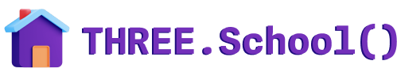

<h1 style="border: none; margin-top: 8px;"></h1>

Repository of the <code>THREE.School()</code> project: a modern, up-to-date, and open-source website for learning <a href="https://threejs.org" blank="_target">Three.js</a>.

<small style="text-align: center; margin: 0 auto; display: block;">This is a work in progress.</small>

 

## TODOs

- Landing Page
- 1: Introduction to Three.js
  - 1.1 Introduction
    -1.1.1 What is Three.js
    - What can I build with Three.js
    - What technologies can I use with Three.js
  - 1.2 Responsiveness
  - 1.3 Prerequisites
  - 1.4 Set up
    - 1.4.1 Webpack
    - 1.4.2 Rollup
- 2 Fundamentals of Three.js
  - 2.1 Geometries
  - 2.2 Materials
  - 2.3 Primitives
  - 2.4 Textures
  - 2.5 Lights
  - 2.6 Shadows
  - 2.7 Fog
  - 2.8 Cameras
